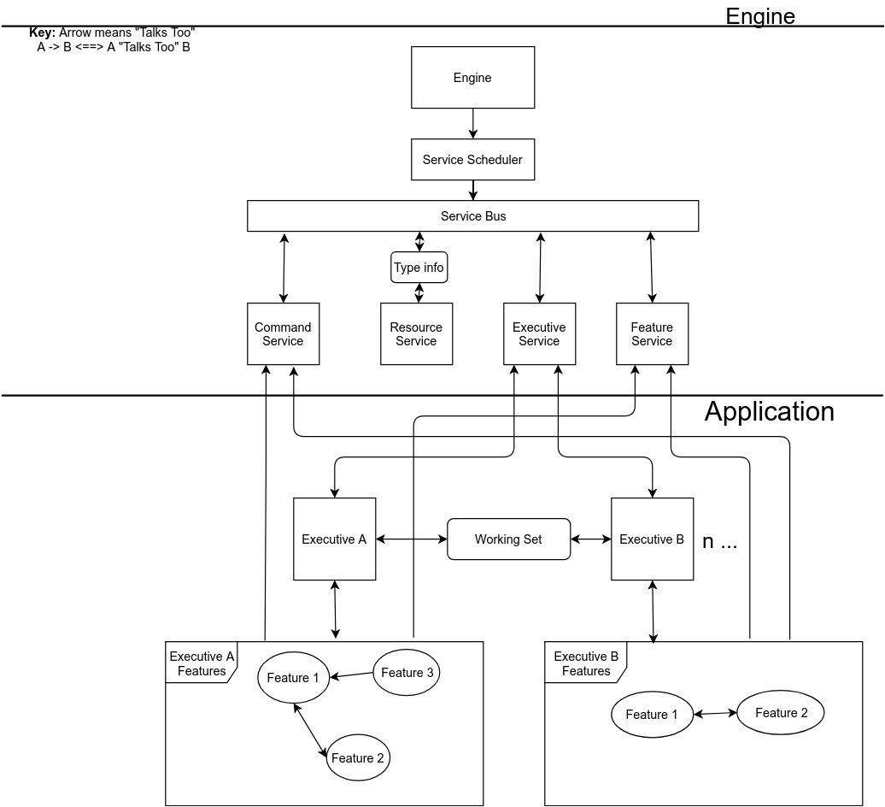

# SolidumEngine
The SolidumEngine is an applications development platform designed for the agile business environment. NOTE: Although functional, this code is not production code. Its purpose is to show only a possible implementation of the Solidum spec.

The following is a simplified diagram of the Solidum architecture.

