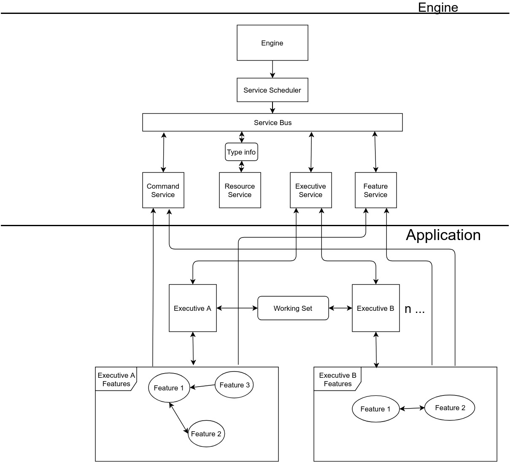

# SolidumEngine
The SolidumEngine is an applications development platform designed for the agile business environment. NOTE: Although functional, this code is NOT production code. Its purpose is to show a possible implementation of the Solidum spec, in a more informal manner.

The following is a simplified diagram of the Solidum architecture.

