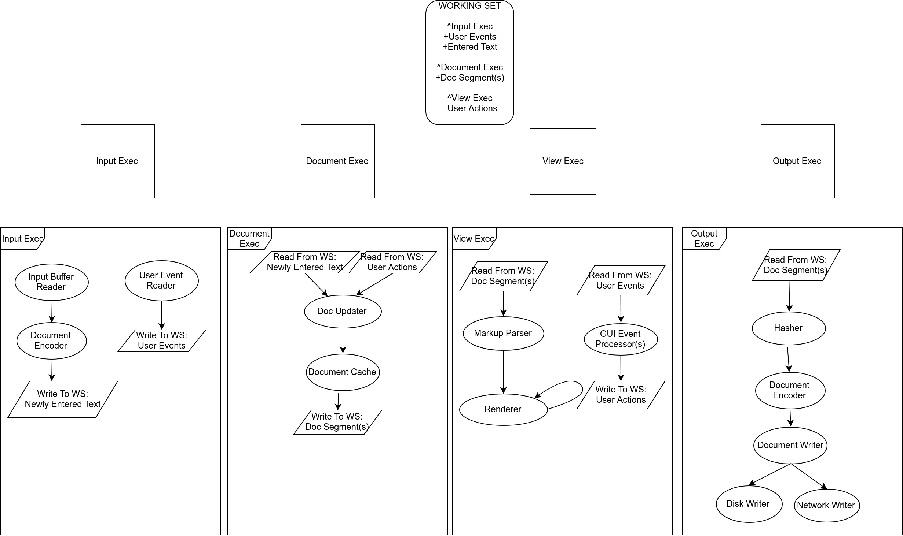

# SolidumEngine

The SolidumEngine is an applications development platform designed for the agile business environment.

The following is a simplified diagram of the Solidum architecture: **More detailed specification provided below diagram.**

# Architecture Overview

The SolidumEngine architecture is based on the following primary design considerations: 
1) Platform must implement a flexible and data oriented API. Providing powerful functionality to the client whilst having the ability to mutate during runtime, based on the requirements of the client.
2) Platform API must be EXTREMELY non intrusive.
3) Platform must harness the power of a data driven paradigm (eg. Those present in game engines) to allow for the rapid, efficient and robust developement of all manner of generic applications.
4) Platform must address some of the limitations present in modern App Dev frameworks such as Qt5.
5) Platform must provide a level of language interoperability.

## Client/Service Model

The SolidumEngine framework is built around a Client/Service model. Meaning the engine provides the user with a set of powerful services. These sevices enable such things as resource management, job scheduling, inter-object communication and most importantly, "Executive" and "Feature" code paths (More on that below).

## Contracts

A critically important component of the SolidumEngine framework is the "Dynamic Contract" or just "Contract". A dynamic contract is a unique data structure which defines a relationship between a client and a service or between two clients. The meaning behind "dynamic" in this context is that, depending on what behavior and attributes the client specifies in the contract, the service may treat the client differently. For example: if I have a client of the "ResourceService", and this client wants to be loadable from disk, said client may specify "isLoadable" = true in their contract. This however does not mean that all clients must be loadable from disk. Furthermore not all clients need be aware that there is a possible isLoadable attribute available to them. The API will adapt.

#### Contract Calling Convention

All callable contract elements support full marshalling of arguments. This means that filter stages may be applied to all element invocations, plus, element calls may be cached or otherwise modified at runtime in a very flexible manner.

**For an example of contract use, look at main.cpp in the root project directory**

## Executives And the Working Set

Now we will begin to discuss some of the core designated features of Solidum. An "Executive" is a user defined, service assisted entity, which governs the flow of data through a set of user defined, service assisted, "Features" (discussed below). An executive takes in a Working Set each execution cycle and may read data from, or write data too the Working Set. Essentially you may look at an executive as being like a subsystem of an application and the working set as being the partitioned data shared between all executives.

## Features

A "Feature" is the atom of your application with regards to Solidum. A "Feature" has some set of inputs, a set of outputs and some sort of executed behavior. Features are enabled by the "Feature Service" and are associated in the form of an undirected graph. Features are passed data by their respective parent "Executives" with said executives able to gather statistical information on the features through the "Executive Service" and "Feature Service".

## Execution Loop, Concurrency And Scheduling

Solidum execution is bound to a flexible yet consistent execution structure. Within the framework there exist two primary schedulers. The service scheduler, and the job scheduler. Upon framework start, all available services are registered with the service scheduler. Next the service scheduler will immediately begin providing each service with processor time. The exact method of time allocation used here will depend on the defined scheduler class(eg. RoundRobin/Threaded). Finally we have the Job scheduler which exists as a component of the "Job Service". This scheduler is highly configurable and provides scheduling functionality to both other services such as the "Feature Service" and more general application clients. NOTE: Within Solidum, a client of the Job Service may create. 1) A timed task, 2) A persistent task or 3) A signallable task. Any client which requires concurrent or timed execution of some behaviour MUST use the Job Service to facilitate this functionality. This allows all tasks to be managed, controlled and scheduled from a central point. Further, The Job Service will break up tasks into individual "Jobs" hence the name, and relate all task creators (clients) through the use of a graph (reminiscent of the "Command Service"). This allows for immense flexibility and configuration.  

# Application Conceptual Example

The following is a possible conceptual implementation of a word processing application, using the Solidum paradigm.

